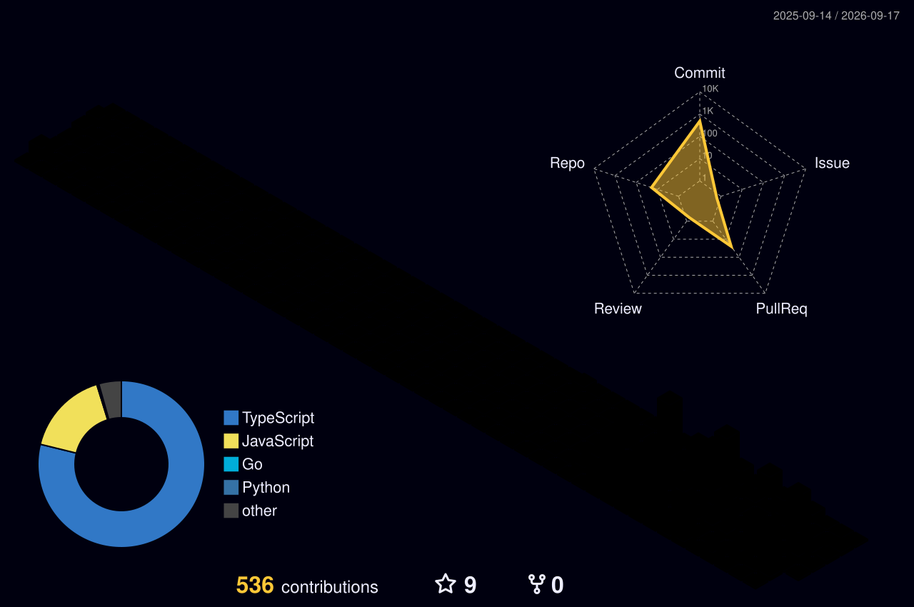

<div align="center">

<!-- Animated Header -->
<a href="https://marsley-mash-site.vercel.app/">
  
</a>

<p align="center">
  <a href="https://marsley-mash-site.vercel.app/">
    
  </a>
  
  <a href="https://github.com/marsley01">
    
  </a>
</p>

<!-- Glowing animated divider -->


</div>


<div align="center">
<a href="https://skillicons.dev">

</a>
</div>
3D Contribution Skyline
<div align="center">
<!-- Generated automatically by profile-3d-contrib action -->

</div>
<div align="center">
<picture>
<source media="(prefers-color-scheme: dark)" srcset="https://raw.githubusercontent.com/marsley01/marsley01/output/github-contribution-grid-snake-dark.svg" />
<source media="(prefers-color-scheme: light)" srcset="https://raw.githubusercontent.com/marsley01/marsley01/output/github-contribution-grid-snake.svg" />

</picture>
</div>

<div align="center">
<table>
<tr>
<td align="center">

</td>
<td align="center">
<!-- Fixed working demolish streak URL -->

</td>
</tr>
</table>

</div>
My main project is Edyfra. My other projects y can find them on https://marsley-mash-site.vercel.app/
<div align="center">
<sub>
  
</sub>
</div>
```
